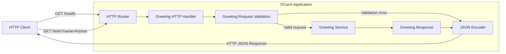
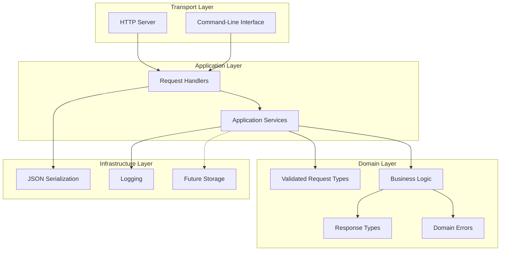
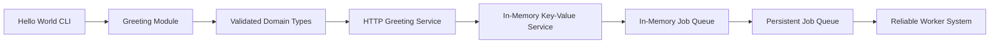
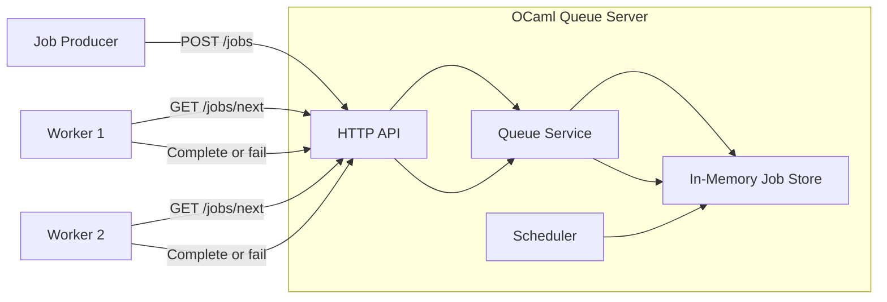
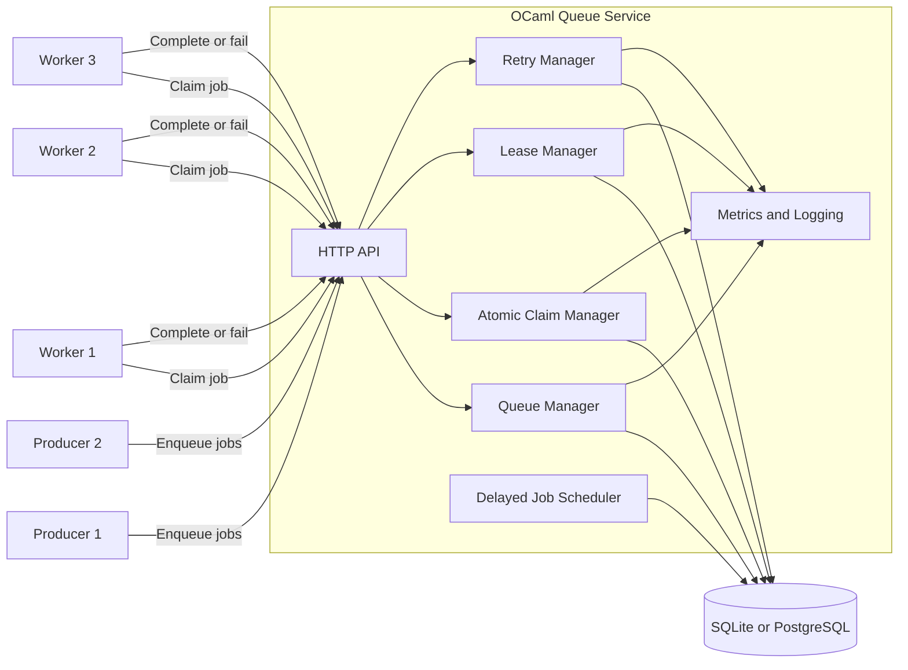
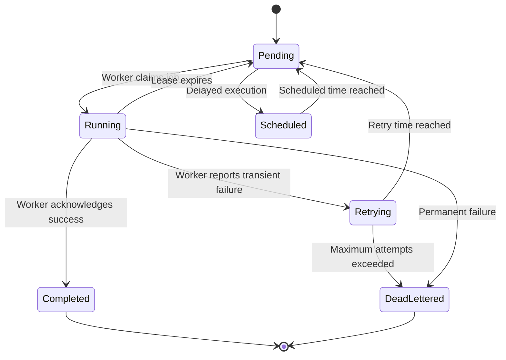
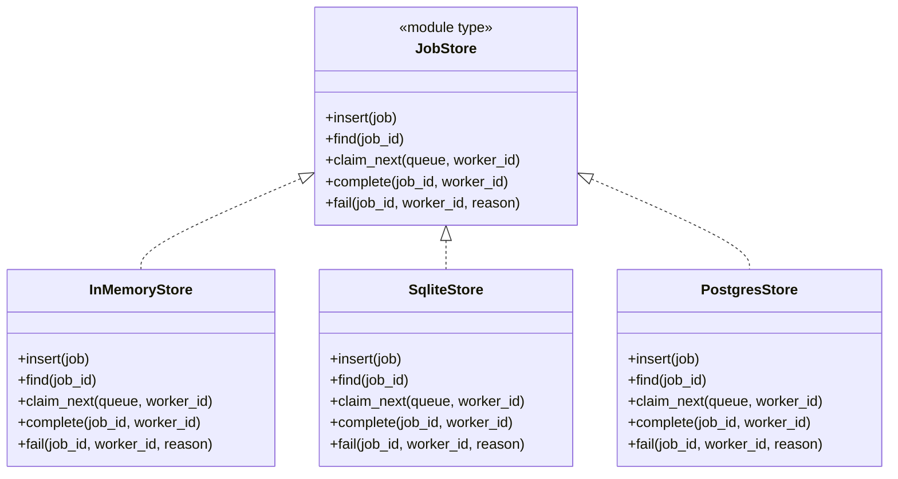

# OCaml Service Architecture

## Overview

This project starts as a small OCaml greeting application and gradually evolves into a reliable background job-processing service.

The initial goal is to establish clean boundaries between:

- Input and transport handling
- Domain validation
- Business logic
- Serialization
- Storage
- Background workers

The core business logic must remain independent of HTTP, databases, and command-line interfaces.

---

## Current Architecture: Greeting Service



### Request flow

```text
HTTP Request
    ↓
Router
    ↓
HTTP Handler
    ↓
Request Validation
    ↓
Business Logic
    ↓
Response Model
    ↓
JSON Serialization
    ↓
HTTP Response
```

---

## Component Responsibilities

### HTTP Router

The router maps incoming requests to the correct handler.

Initial routes:

```text
GET /health
GET /hello?name=<name>
```

The router should not contain business logic.

### HTTP Handler

The handler acts as an adapter between HTTP and the domain layer.

Responsibilities:

- Read query parameters
- Convert raw input into domain requests
- Call the appropriate service
- Convert domain results into HTTP responses
- Select the correct HTTP status code

The handler should remain small.

### Greeting Request

The request module validates raw input and creates a valid domain request.

```ocaml
type t = {
  name : string;
}

type error =
  | Empty_name
  | Name_too_long of int
```

Creation returns an explicit result:

```ocaml
val create : string -> (t, error) result
```

This ensures the greeting service only receives validated input.

### Greeting Service

The greeting service contains the business logic.

```ocaml
val create : Greeting_request.t -> Greeting_response.t
```

It does not know whether the request originated from:

- HTTP
- The command line
- A test
- A message queue

### Greeting Response

The response module represents the result produced by the business logic.

```ocaml
type t = {
  message : string;
}
```

It does not contain HTTP-specific concepts such as status codes or headers.

### JSON Adapter

The JSON adapter converts domain responses and errors into JSON.

Example success response:

```json
{
    "message": "Hello, Kishan!"
}
```

Example error response:

```json
{
    "error": "Name cannot be empty"
}
```

---

## Layered Architecture



### Dependency direction

Dependencies should point inward toward the domain.

```text
Transport → Application → Domain
Infrastructure → Application or Domain interfaces
```

The domain layer must not depend on:

- HTTP libraries
- JSON libraries
- SQLite or PostgreSQL
- Command-line parsing
- Operating-system processes

---

<!-- ## Proposed Project Structure

```text
ocaml-service/
├── bin/
│   ├── main.ml
│   └── dune
│
├── lib/
│   ├── domain/
│   │   ├── greeting_request.ml
│   │   ├── greeting_request.mli
│   │   ├── greeting_response.ml
│   │   ├── greeting_response.mli
│   │   ├── greeting.ml
│   │   └── greeting.mli
│   │
│   ├── application/
│   │   ├── greeting_handler.ml
│   │   └── greeting_handler.mli
│   │
│   ├── transport/
│   │   ├── http_router.ml
│   │   ├── http_router.mli
│   │   ├── http_server.ml
│   │   └── http_server.mli
│   │
│   ├── infrastructure/
│   │   ├── json_adapter.ml
│   │   ├── json_adapter.mli
│   │   ├── logger.ml
│   │   └── logger.mli
│   │
│   └── dune
│
├── test/
│   ├── greeting_request_test.ml
│   ├── greeting_service_test.ml
│   ├── http_handler_test.ml
│   └── dune
│
├── docs/
│   └── architecture.md
│
├── dune-project
└── README.md
``` -->

For the first version, the folder structure may remain simpler. The directories can be introduced as the project grows.

---

## Initial HTTP API

### Health check

```http
GET /health
```

Response:

```json
{
    "status": "ok"
}
```

Status:

```text
200 OK
```

### Greeting

```http
GET /hello?name=Kishan
```

Response:

```json
{
    "message": "Hello, Kishan!"
}
```

Status:

```text
200 OK
```

### Validation error

```http
GET /hello?name=
```

Response:

```json
{
    "error": "Name cannot be empty"
}
```

Status:

```text
400 Bad Request
```

### Unknown route

```http
GET /unknown
```

Response:

```json
{
    "error": "Route not found"
}
```

Status:

```text
404 Not Found
```

---

## Evolution Toward a Job Queue

The greeting service is the first building block. It will evolve through the following stages:



---

## Intermediate Architecture: In-Memory Job Queue

After the greeting service, the application will introduce jobs and workers.



Initial queue endpoints:

```text
POST /jobs
GET  /jobs/next
POST /jobs/:id/complete
POST /jobs/:id/fail
```

---

## Target Architecture: Reliable Job Queue



---

## Job Lifecycle



The initial implementation should only support:

```text
Pending → Running → Completed
                  → Failed
```

Retries, leases, scheduling, and dead-letter handling will be added later.

---

## Storage Abstraction

The queue service should depend on an interface rather than a specific database.



Possible OCaml interface:

```ocaml
module type JOB_STORE = sig
  val insert :
    Job.t ->
    (unit, Store_error.t) result

  val find :
    Job_id.t ->
    (Job.t option, Store_error.t) result

  val claim_next :
    queue:string ->
    worker_id:Worker_id.t ->
    (Job.t option, Store_error.t) result

  val complete :
    job_id:Job_id.t ->
    worker_id:Worker_id.t ->
    (unit, Store_error.t) result

  val fail :
    job_id:Job_id.t ->
    worker_id:Worker_id.t ->
    reason:string ->
    (unit, Store_error.t) result
end
```

This allows the service to start with in-memory storage and later move to SQLite or PostgreSQL without rewriting the domain logic.

---

## Design Principles

### Keep the domain independent

Domain modules should contain:

- Job types
- State transitions
- Validation
- Retry rules
- Lease rules

They should not contain:

- SQL
- HTTP handlers
- JSON parsing
- Logging configuration

### Validate at system boundaries

Raw strings and JSON values should be validated before entering the domain layer.

### Represent expected failures explicitly

Use:

```ocaml
('value, 'error) result
```

for expected failures such as:

- Invalid input
- Job not found
- Invalid state transition
- Queue full
- Lease expired

### Make invalid states difficult to represent

Prefer algebraic data types over unrelated booleans and nullable fields.

```ocaml
type job_state =
  | Pending
  | Running of running_info
  | Completed of completion_info
  | Failed of failure_info
```

### Build one reliability property at a time

The development order should be:

```text
Correct local behaviour
    ↓
Concurrent behaviour
    ↓
Persistence
    ↓
Failure recovery
    ↓
Retries
    ↓
Observability
    ↓
Scalability
```

---

## Current Milestone

The current milestone is intentionally small.

```text
Client
  ↓
HTTP Router
  ↓
Greeting Handler
  ↓
Validated Greeting Request
  ↓
Greeting Service
  ↓
Greeting Response
  ↓
JSON Response
```

Deliverables:

- `GET /health`
- `GET /hello?name=<name>`
- Input validation
- JSON responses
- Unit tests
- No database
- No worker processes
- No distributed behaviour

This milestone establishes the architectural boundaries that will be reused when the application becomes a job queue.
